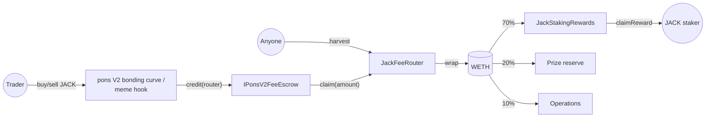

# JACK Architecture — Phase 1 (fee routing + staking)

This document describes the real `$JACK` fee-routing and staking infrastructure added in Phase 1:
`JackFeeRouter.sol` and `JackStakingRewards.sol`. **No `$JACK` token has been launched.** These
contracts are deployable and testable today, in isolation from any live token, and are wired to
the real token in one permissioned, one-time step once it exists. See
[JACK_LAUNCH_CHECKLIST.md](JACK_LAUNCH_CHECKLIST.md) for what still has to happen before that, and
[JACK_THREAT_MODEL.md](JACK_THREAT_MODEL.md) for the risks this design accepts and why. This is
entirely separate from, and does not modify, the existing testnet-MVP mock-token system described
in [ARCHITECTURE.md](ARCHITECTURE.md) — `MockJACK` remains a valueless demo token with no
relationship to real `$JACK` (see `MockJACK.sol` and CLAUDE.md).

## Why pons V2

The real `$JACK` token will be created through
[pons](https://www.ponsfamily.com)'s V2 launch factory on Robinhood Chain mainnet — a bonding-curve
launchpad that graduates into a permanently-locked Uniswap V4 pool. Pons V2 pays a configurable
share of every trade's fees to a creator-chosen `creatorFeeRecipient` address, held claimable in a
shared escrow contract. That `creatorFeeRecipient` **can be a contract**, so this repository
registers `JackFeeRouter` — never a person's wallet — as JACK's creator fee recipient, and the
router is the only thing that ever touches those fees.

## How the pons V2 integration was verified

Per CLAUDE.md's absolute rule against fabricating addresses or integrations, every fact below was
independently confirmed — not assumed — before any code was written against it:

1. **Source.** The official repository,
   [github.com/ponsdotdev/ponsfamily](https://github.com/ponsdotdev/ponsfamily), pinned at commit
   `8b9bf371030279133017b5c1b713823f5889c5d2` (MIT licensed, first-party V2 contracts — see
   [THIRD_PARTY_NOTICES.md](../THIRD_PARTY_NOTICES.md)). `contractsV2/src/v2/PonsV2LaunchFactory.sol`,
   `PonsV2BondingCurve.sol`, `PonsV2LauncherToken.sol`, `hooks/PonsV2MemeHook.sol`, and
   `interfaces/ILaunchpadV2.sol` were read in full.
2. **Live chain state.** Read-only `cast call`s against `https://rpc.mainnet.chain.robinhood.com`
   (chain id `4663`, confirmed via `cast chain-id`) at block ~56,932,709, cross-checked field by
   field against the source above. Every value in the table below was read live, not copied from
   documentation.
3. **Cross-validation.** The canonical WETH address was independently confirmed two ways —
   Robinhood Chain's own docs (`docs.robinhood.com/chain/contracts`) and on-chain
   (`name()`/`symbol()`/`decimals()`/`totalSupply()`) — and that same docs page's reported USDG
   address matches this repository's pre-existing `CANONICAL_MAINNET_USDG` constant
   (`packages/config/src/chains.ts`) exactly, giving independent corroboration of the same source.
4. **A real, forked launch.** `test/JackRobinhoodMainnetFork.t.sol` performs an actual
   `factory.launchToken(...)` call against the live, deployed factory on a fork, and a real
   `credit`/`claim`/`balanceOf` round trip against the live, deployed fee escrow — see
   "What was *not* independently verified" below for the one thing this does not attempt.

No live address, ABI, bytecode, or economic assumption disagreed with the source or with the task
this integration was built against. In particular, the sole enabled launch config's `supply` field
reads exactly `1,000,000,000 * 1e18` — matching the documented target fixed supply for JACK with no
discrepancy to report.

### Verified state (Robinhood Chain mainnet, chain id 4663)

| Item | Value |
| --- | --- |
| pons V2 launch factory | `0x7eD598BcEf8bd9Edd8C97A195C6d13f40801EC7e` |
| `launchEnabled` | `true` |
| `launchFee` | `0.0005 ETH` |
| `launchConfigCount` | `1` |
| Launch config `0` | `enabled=true`, `supply=1,000,000,000e18`, `curveFeeBps=100`, `phantomQuote=1.68 ETH`, `graduationThreshold=4.2 ETH`, `poolFee=0`, `tickSpacing=200` |
| `feeEscrow` | `0xd3AFEB2a57f70eF218Aa82451c51B2fb0416Ac9e` |
| `memeHook` | `0xE5e702641Ea86F4ae6cC3cDaeD2B886f976Be044` |
| `launchDeployer` | `0x3711ceA4feaDE896C913C68F01Eda97Cb06D1A42` |
| `maxCreatorTaxBps` | `1000` (10%) |
| Fee policy (`memeHook.currentFeePolicy()`) | `protocolFeeShareBps=3000`, `buybackBurnBps=5000`, `hookFeeBps=100`, `maxInternalPriceImpactBps=300` |
| `feeSweepOperator` | `0x49BbF2b70955Fb3a106e084D4BFDa92d334573d2` |
| Protocol owner | `0x263ed295dAFaE1d9AAdD6E56c4B6F9f38eE019Dd` (a contract — 171 bytes of bytecode, not a bare EOA) |
| Canonical Robinhood Chain WETH | `0x0Bd7D308f8E1639FAb988df18A8011f41EAcAD73` |

Run `forge script script/PrintPonsV2State.s.sol --rpc-url $ROBINHOOD_MAINNET_RPC_URL` at any time
to re-read this table live — **every figure above is owner-adjustable pons-side and must be
re-verified, never assumed from this table, before any future real action** (see
[JACK_LAUNCH_CHECKLIST.md](JACK_LAUNCH_CHECKLIST.md)).

### Confirmed from source

- **`creatorFeeRecipient` may be a contract.** `PonsV2LaunchFactory._launchToken` places no
  EOA-only restriction on it.
- **Creator fees are credited to `IPonsV2FeeEscrow`.** Confirmed by direct source quote, not
  inference: `PonsV2BondingCurve._creditQuote` (pre-graduation trades) and `PonsV2MemeHook`
  (post-graduation trades) both call `feeEscrow.credit{value: amount}(recipient)` for a
  native-ETH-quote launch.
- **The recipient can claim native ETH.** `IPonsV2FeeEscrow.claim()` / `claim(uint256)`.
- **The creator recipient can be transferred.** `PonsV2LaunchFactory.transferCreatorFeeRecipient`,
  callable only by the current `creatorFeeRecipient`. *(JackFeeRouter never calls this — see "A
  standing pons-side risk" below.)*
- **`PonsV2LauncherToken` supports `ERC20Burnable`/`burnFrom`.** It extends both `ERC20` and
  `ERC20Burnable` directly.
- **The pons protocol owner retains a timelocked creator-recipient override.**
  `setCreatorFeeRecipient` (propose) / `executeCreatorFeeRecipientChange` (execute) /
  `cancelCreatorFeeRecipientChange`, gated by `CREATOR_FEE_RECIPIENT_TIMELOCK` (3 days) and a
  `CREATOR_FEE_RECIPIENT_EXECUTION_WINDOW` (3 days) — both read live on-chain as exactly `259200`
  seconds, matching source.

### What was *not* independently verified

The pons V2 bonding curve's own trade (buy/sell) calldata shape was **not** reverse-engineered or
depended on anywhere in this codebase — not in the contracts, not in the fork test, not in the
lifecycle-simulation script. Everything here depends only on `launchToken`, `getLaunchedToken`,
and the fee escrow's `credit`/`claim`/`balanceOf` — all read directly from source and exercised for
real on a fork. Where a test or script needs a launch token to hold a balance (to demonstrate
staking), it moves tokens from the bonding curve's own address, which source confirms holds the
launch's entire minted supply — not a fabricated balance.

The fee escrow's own **implementation** is not open-sourced in the pons V2 repository (only
`IPonsV2FeeEscrow`, the interface, is defined there) — see
[JACK_THREAT_MODEL.md](JACK_THREAT_MODEL.md#pons-v2-is-an-external-dependency) for why
`JackFeeRouter` treats it as an untrusted external call target regardless.

## Fee flow

1. A trade against JACK's bonding curve (pre-graduation) or its graduated Uniswap V4 pool
   (post-graduation) generates a creator-fee share, credited as native ETH to `JackFeeRouter`'s
   balance in pons V2's shared `IPonsV2FeeEscrow`.
2. Anyone calls `JackFeeRouter.harvest()`. It reads the router's claimable balance, claims exactly
   that amount, measures the actual ETH received, wraps it to WETH, and splits it 70/20/10 between
   `staking`, the prize reserve, and operations — see `JackFeeRouter.sol`'s NatSpec for the exact
   rounding rule (the last share always absorbs the remainder, so the three shares sum to exactly
   what was received, never more, never less).
3. `JackStakingRewards.notifyRewardAmount` streams the staker share linearly over a fresh 7-day
   window, combining it with any undistributed remainder of an in-progress stream — or, if nobody
   is staked, queues it until someone is (see "Zero-staker queuing" below).
4. Stakers call `claimReward` (or `exit`) at any time to collect what has streamed to them so far.

## Contract responsibilities

### `src/staking/JackStakingRewards.sol`

Non-upgradeable. Holds real `$JACK` deposits and pays real WETH rewards. O(1) accounting via the
standard `rewardPerToken` pattern (see [THIRD_PARTY_NOTICES.md](../THIRD_PARTY_NOTICES.md) —
original code, not vendored) — no loop over holders anywhere in this contract.

- **Immutables:** `stakingToken` (JACK), `rewardToken` (WETH), `distributor` (JackFeeRouter's
  address). Deploy this contract only after both JACK and JackFeeRouter exist.
- **Zero-staker queuing.** A harvest that lands while `totalStaked == 0` cannot start a stream —
  there is nobody for `rewardPerToken` to credit it to. It is added to `queuedRewards` instead, and
  the invariant "`totalStaked == 0` implies `rewardRate == 0`" is maintained from the other
  direction too: a withdrawal that drains the last staker mid-stream folds the stream's
  remaining, not-yet-earned amount back into `queuedRewards` and zeroes the rate. The next
  `stake()` (by anyone) starts a fresh 7-day stream from everything queued. No reward token is
  ever silently stranded — see `test/JackStakingRewards.t.sol`'s
  `test_lastStakerLeaving_queuesRemainderInsteadOfLosingIt` and
  `test_firstStakeAfterQueuing_startsFreshStream`.
- **Reward top-ups.** A harvest landing during an already-active stream combines the stream's
  undistributed remainder with the new amount and restarts a full 7-day window — the standard
  Synthetix StakingRewards pattern. This is also what makes "stake one second before a huge
  harvest" safe: that harvest streams linearly over the *next* seven days, not instantly (see
  `test_stakeImmediatelyBeforeLargeHarvest_doesNotPayInstantly`).
- **Pause** gates `stake` only; `withdraw`, `claimReward`, and `exit` never carry `whenNotPaused`.
- **`rescue`** unconditionally refuses both `stakingToken` and `rewardToken`, regardless of any
  "surplus balance" calculation — there is no owner code path, buggy or otherwise, that reaches a
  staker's principal or earned/queued/streaming reward.
- **Donations.** `totalStaked` is tracked purely by internal accounting, never by reading
  `stakingToken.balanceOf(address(this))` — a direct JACK transfer is never credited to anyone and
  is not withdrawable or rescuable. A direct WETH transfer similarly sits unaccounted, never
  streamed. Neither can corrupt accounting.
- **Payouts never push native ETH.** Both `withdraw` (JACK) and `claimReward` (WETH) use
  `SafeERC20.safeTransfer` — a malicious or merely non-payable recipient contract cannot block its
  own or anyone else's payout.

### `src/fees/JackFeeRouter.sol`

Non-upgradeable. Registered as JACK's pons V2 `creatorFeeRecipient`.

- **Deployable before JACK exists.** The constructor only takes the already-verified pons
  factory/escrow/WETH addresses, the prize-reserve/operations recipients, and the immutable
  70/20/10 split (validated to sum to exactly 10,000 bps). `configureJack` wires in the real token
  and its staking contract exactly once, after launch, validating the live
  `factory.getLaunchedToken` record (exists, `creatorFeeRecipient == address(this)`,
  `pairToken == address(0)`) and the staking contract's own immutables
  (`stakingToken`/`rewardToken`) against it.
- **The 70/20/10 split is immutable.** Nothing in this contract can change it post-deployment —
  the only levers are *who* receives the prize-reserve/operations shares (owner-settable, like
  `YieldJackVault.depositCap` elsewhere in this repo) and, under a mandatory 7-day timelock,
  *which contract* receives the staker share (see "Staking migration" below). The staker share
  itself is never redirectable to anything other than the currently-configured `staking` contract.
- **`harvest` wraps to WETH before distributing.** Every payout below that point —
  prize reserve, operations, and `staking` via `notifyRewardAmount` — is a `SafeERC20.safeTransfer`
  of WETH, never a native-ETH push, for the same "cannot be blocked by a hostile recipient" reason
  as `JackStakingRewards`'s payouts (see `test_harvest_succeedsWithRevertingRecipients`).
- **`harvest` measures, never trusts.** It claims exactly the escrow balance it just read (via the
  amount-specified `claim(uint256)` overload, not the claim-everything one), then measures the
  actual native-ETH balance delta rather than trusting either number — see
  `test_harvest_measuresActualEthReceivedOnShortfall`.
- **No swap, price oracle, or JACK-selling logic anywhere.** The router never holds or transacts in
  JACK at all.
- **No generic/arbitrary-call admin function.** Every WETH-moving code path is inside `harvest`,
  which always computes shares from a fresh claim.
- **`receive()` only accepts ETH from `feeEscrow`** — the one source `harvest` ever expects
  payment from. Every other sender is rejected.
- **Staking migration** (recovering from a compromised or buggy staking contract) is only possible
  through `proposeStakingMigration` / `executeStakingMigration`, gated by a mandatory
  `STAKING_MIGRATION_TIMELOCK` (7 days) visible on-chain for its full duration before it can be
  executed, and validated against the replacement's own `stakingToken`/`rewardToken` immutables.

## What Phase 1 deliberately does not do

- Launch a token. `deployments/4663.json` is unchanged; no real `$JACK` address exists anywhere in
  this repository.
- Broadcast anything to Robinhood Chain mainnet. Every on-chain interaction in this phase is a
  read-only `cast call`/`forge script` simulation or a `forge test` fork test.
- Touch `MockJACK`, `YieldJackVault`, `DemoPrizeEngine`, `SponsorRegistry`, or any other existing
  mainnet-demo contract or address.
